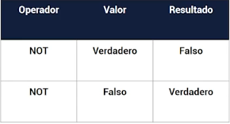
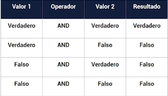
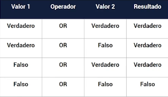

# Conceptos basicos

## Sintaxis

- Reglas de sintaxis
    - {} Llaves define bloques de codigo
    - Para definir que una expresion de codigo termino.

```injectablephp
<?php
    $name = 'Sergio';
    echo 'Hola' . $name;
?>
```

## Tipos de datos

- Desde PHP 7.4 existen tipado:
    - **Explicito**: Define una sintaxis para la creación de variables con tipo de dato.
    - **Inferido**: PHP tiene la habilidad de deducir el tipo en función de un valor.
  > **Nota**: Es tipo de datos Explicito solo se puede utilizar
  > en los atributos de una clase, parametros de una función
  > y tipo de retorno de una función.

>

- Tipos de datos: https://www.php.net/manual/es/language.types.intro.php
    - int: [Documentación](https://www.php.net/manual/es/language.types.integer.php)
    - double o float: [Documentación](https://www.php.net/manual/es/language.types.float.php)
    - bool: [Documentación](https://www.php.net/manual/es/language.types.boolean.php)
    - string: [Documentación](https://www.php.net/manual/es/language.types.string.php)
        - Usar comillas dobles `""` o comillas simples `''`.
            - Usando comillas simples donde el texto será exactamente como se escribe-
            - Usando comillas dobles permite usar caracteres de escape y reconoce las variables, es decir sustituye el
              valor de las variables dentro de las cadenas.
        - Cadenas de multiples lineas
            - Heredoc
            - Nowdoc
    - Arreglos: [Documentación](https://www.php.net/manual/es/language.types.array.php)
        - Es una variable que puede guardar multiples valores
        - Un array es en realidad un mapa ordenado. Un mapa es un tipo de datos de clave y valor.
        - Se puede utilizar de varias formas
            - Array
            - Lista
            - Tabla Asosiativas
            - Diccionario
            - colección
            - Pila
            - Cola
        - Se utiliza para arreglos multi dimensionales
        - Se utiliza para crear arboles.
        - Manipulacion de arreglos: https://www.php.net/manual/es/ref.array.php
    - objectos: https://www.php.net/manual/es/language.types.object.php
    - iterables: https://www.php.net/manual/es/language.types.iterable.php
    - callbacks: https://www.php.net/manual/es/language.types.callable.php
    - resources: https://www.php.net/manual/es/language.types.resource.php
    - null
- [Ejemplo2](../examples/2-basic/2-data-types/README.md)

## Variables

- En PHP las variables se representan con un signo de dólar `$` seguido por el nombre de la variable
- Las variables son sensibles a minúsculas y mayúsculas.
- Las variables tienen que tener nombres significativos
- Una variable no puedo comenzar con numeros
- una variable no puedo contener espacios y simbolos especiales

## Constantes

- Una constante es una expresion cuyo valor no puede ser modificado.
- Las constantes siempre deben ser en mayuscula siguiendo el formato snake. Utilizar guión bajo `_` para separar las
  palabras.
- Una constante es mas utilizada para definir ubicacion, datos de conexion a na base de datos.
- Una constante en PHP se puede declarar de dos formas
    - `define('PI', 3.1416)`
        - Define constantes en tiempo de ejecución
    - `const PI = 3.1416` disponible desde PHP 5.3
        - Define constantes en tiempo de compilación

## Comentarios

- Comentarios de linea
    - `//` o `#`
- Comentarios de varias lineas

```phpregexp
/*
  Comentario con
  varias
  lineas
*/
```

- Comentarios de documentación

```phpregexp
/**
 * @autor Sergio
 */
```

- [ejemplo4](../examples/2-basic/5-comentarios/README.md)

## Operadores Aritmeticos

- En que orden se evaluan las matematicas operaciones complejas
    1. Parentesis
    2. Exponenetes
    3. Multiplicacion/Division
    4. Adición/Sustracción
- Una forma facil de recordar este orden es usando el acronimo PEMDAS
    - Parentesis
    - Exponentes
    - Multiplicación
    - División
    - Adición
    - Sustracción
- Suma `+`
- Resta `-`
- Multiplicación `*`
- División `/`
- Modulo `%` es el restante de una división
- Potencia `**` calcula la potencia de un numero

## Operadores de comparación
- `==` igual, compara el valor
- `!=` No igual o diferente, compara el valor
- `===` Igual estricto, compara el tipo y el valor
- `!==` No igual estricto, compara el tipo y el valor
- `<` menor que
- `>` mayor que
- `<=` menor o igual que
- `>=` mayor o igual que
- '<=>' Operador nave espacial

## Operadores de Asignación

- `??=` Para asignar sólo si la variable asignada es nula
- `=` asignar valor
- `+=`
- `-=`
- `*=`
- `/=`
- `%=`
- `.=` concatenacion

```
// Asigna al valor a variable a
a = value;

// Ejemplo de asignacion
a +=b; //
a = a + b;
```


## Operadores Logicos

- `!expresión` Realiza una negación en la expresión

  

```injectablephp
// Not (los perritos pueden volar)(value1) = false
// Los perritos no pueden volar
$result = !$value1;
```

- `&&` o `AND` AND



```injectablephp
// (Los perritos tienen su nombre Propio)(value1) AND(&&) (son muy rapidos)(value2) = true o verdadero
$result = $value1 && $value2; //
// (Los perritos saben programar)(value1) AND(&&) (pueden volar)(value2) = false o falso
$result2 = $value1 and $value2; // false
```

- `||` OR

  

```injectablephp
// (Los perritos tienen su nombre Propio)(value1) OR(||) (son muy rapidos)(value2) = true o verdadero
$result = $value1 || $value2; //
// (Los perritos saben programar)(value1) or(||) (pueden volar)(value2) = false o falso
$result2 = $value1 or $value2; // false
```

## Operadores de incremento y decremento
- `++i` Pre incremento
- `i++` Post incremento
- `--i` Pre decremento
- `i--` Post decremento

## Operador Ternario
- El operador tenerario si lo utilizo en java, php, dart y podra utilizarlo en javascript de la misma forma.
- `condition ? (statement if true) : (statement if false);`


